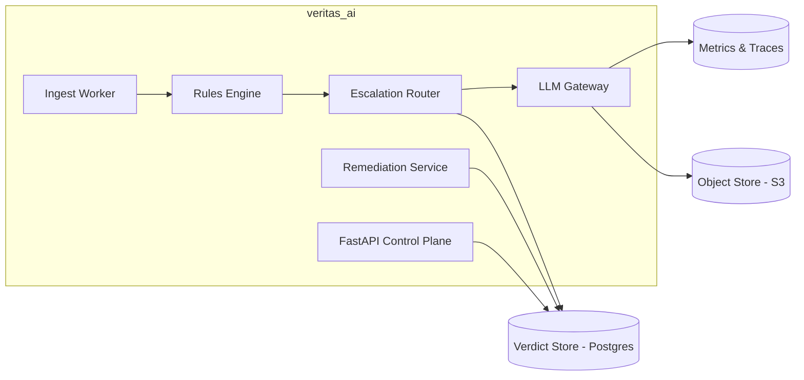
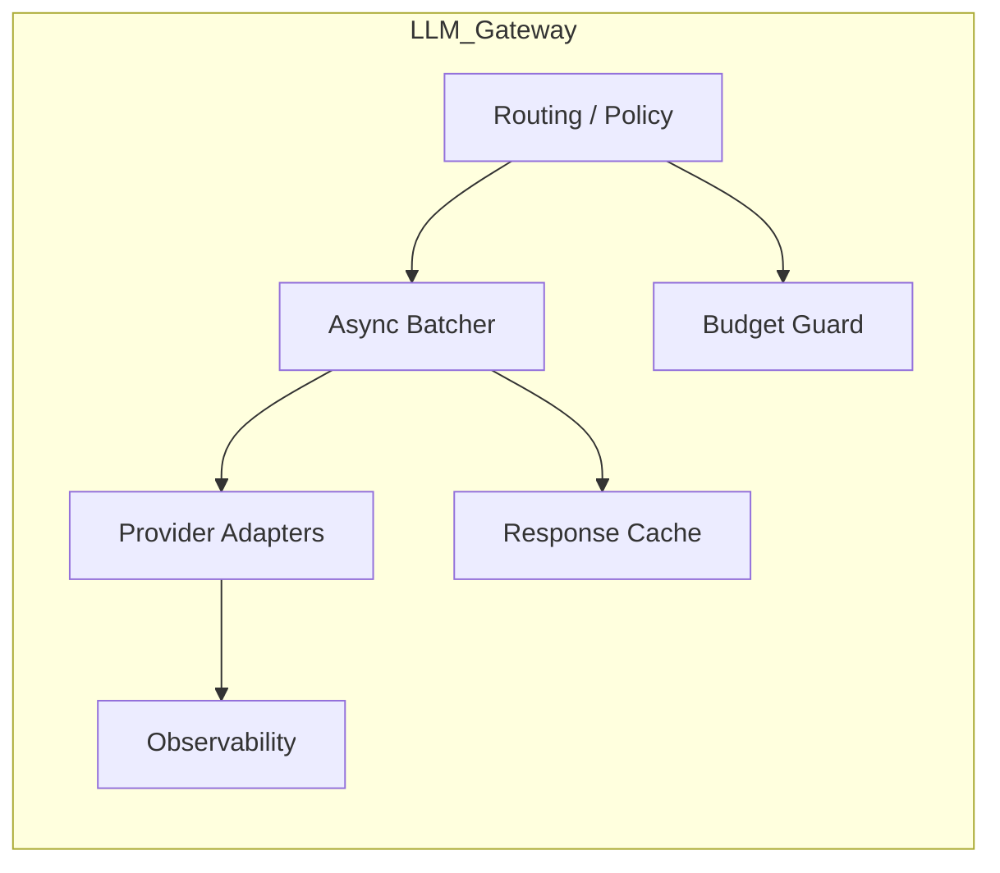
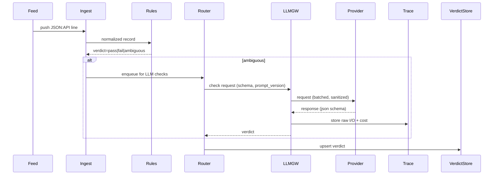
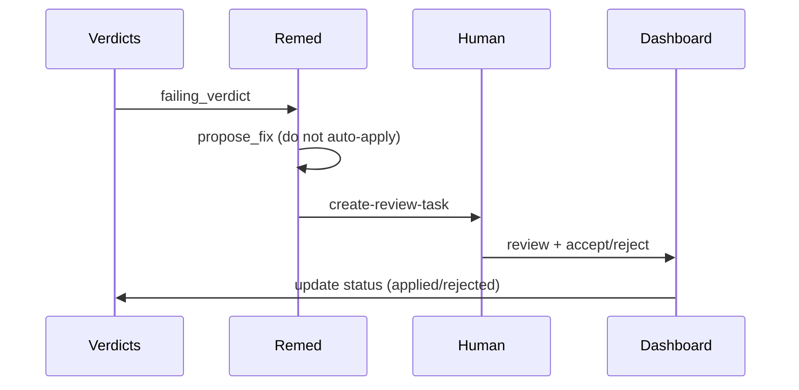

# VeritasAI — Architecture Review

Author: Principal AI Platform Engineer
Date: 2026-06-22

Purpose: a concise, reviewer-grade architecture review for the VeritasAI Data Quality pipeline (ingest → rules → LLM checks → remediation → tracing). No implementation code here — design, contracts, and risks only.

--

**Contents**
- C4 diagrams (system context, containers, components)
- Sequence diagrams (key flows)
- Data contracts (JSON schemas)
- API contracts (REST endpoints)
- Event schemas
- Storage design (schema, partitioning, retention)
- Security model
- Cost model and budgeting
- Deployment topology
- Failure mode analysis
- Reviewer-grade upgrade recommendations

--

**1. C4 Diagrams**

System Context (high level)

```mermaid
flowchart LR
  User[Data Team / Human Reviewer] -->|uploads / monitors| Ingest[Ingest Worker]
  Ingest --> Rules[Rules Engine]
  Rules -->|pass/quarantine| Store[(Events DB)]
  Rules -->|ambiguous| Escalation[Escalation Router]
  Escalation --> LLMGateway[LLM Gateway]
  LLMGateway -->|Haiku / Sonnet| ModelProviders[(Providers)]
  LLMGateway --> Trace[Trace Store (S3)]
  Trace -->|index| Verdicts[(Verdict DB)]
  Verdicts --> Remed[Remediation Skill]
  Remed --> Human[Human Review Queue]
  Human --> Dashboard[Dashboard]
  Monitor[Monitoring & Alerts] -.->|metrics/traces| LLMGateway
  Monitor -.->|metrics| Verdicts
```

Container view (major deployable services)



Component view (within LLM Gateway)


```

**2. Sequence diagrams (key flows)**

A. Ingest → Rule triage → LLM escalation → Verdict



B. Remediation and human review



**3. Data contracts**

Event record (flattened, minimal) — JSON Schema sketch

```json
{
  "$id": "https://veritas.ai/schemas/event.json",
  "type": "object",
  "required": ["event_id","category","summary","found_at","included"],
  "properties": {
    "event_id": {"type":"string","format":"uuid"},
    "category": {"type":"string"},
    "summary": {"type":"string"},
    "found_at": {"type":"string","format":"date-time"},
    "confidence": {"type":"number","minimum":0,"maximum":1},
    "included": {"type":"array"}
  }
}
```

LLM verdict contract (strict JSON schema)

```json
{
  "$id": "https://veritas.ai/schemas/verdict.json",
  "type":"object",
  "required":["check","verdict","confidence","reason"],
  "properties":{
    "check":{"type":"string"},
    "verdict":{"type":"string","enum":["pass","fail","uncertain"]},
    "confidence":{"type":"number","minimum":0,"maximum":1},
    "reason":{"type":"string"},
    "evidence_span":{"type":"string"}
  }
}
```

Trace record (per LLM call)

```json
{
  "event_id":"uuid",
  "check":"semantic_accuracy",
  "prompt_version":"semantic_accuracy.v3",
  "model":"haiku-1",
  "input_tokens":123,
  "output_tokens":12,
  "latency_ms":456,
  "cost_usd":0.0007,
  "response":{...}
}
```

**4. API contracts**

Design principle: small, typed REST endpoints (FastAPI), all endpoints require mTLS + token-based auth.

- POST /ingest/batch
  - request: NDJSON or JSON array of `event` objects
  - response: 202 Accepted, location header to check progress

- POST /checks/{event_id}/run
  - request: { checks: ["semantic_accuracy"] , prompt_version?: string }
  - response: 200 { status: queued | in_progress | completed }

- GET /events/{event_id}
  - response: 200 Event + latest verdicts

- GET /verdicts?day=2026-06-22&check=semantic_accuracy
  - response: paginated verdicts

- POST /llm/gateway/health
  - request: internal only; returns provider statuses, budget usage

Errors: standard RFC 7807 problem details. Rate-limit: per-API key and per-customer quotas.

Auth & minting: integrate with org SSO (OIDC) and service principals for pipeline services.

**5. Event schemas (events bus)**

Use compact Avro/Protobuf schemas for inter-service events. Example topics:
- events.ingested (payload: event_id, raw_path, metadata)
- events.rules_result (payload: event_id, rule_results[])
- events.llm_verdict (payload: event_id, check, verdict_id, summary)
- events.remediation_proposed (payload: event_id, proposal_id, proposals[])

Each message includes a provenance header: {producer, commit, prompt_version, ts, request_id}.

**6. Storage design**

Primary systems:
- OLTP: Postgres (provisioned, HA) for `events_clean`, `quality_verdicts`, `review_tasks`.
- Object store: S3-compatible for raw payloads and LLM raw I/O traces.
- OLAP: (optional) ClickHouse/BigQuery for cost & metric analytics at scale.

Key tables (Postgres):
- events_clean (partitioned by month)
  - event_id UUID PK, category TEXT, summary TEXT, found_at timestamptz, status TEXT, raw_path TEXT
- quality_verdicts (partitioned by day)
  - id PK, event_id FK, check_name, check_type, verdict, confidence NUMERIC, reason TEXT, prompt_version, model, cost_usd, latency_ms, ts
- review_tasks
  - id, event_id, assigned_to, status, created_at, resolved_at, decision

Partitioning & indexing:
- Partition `events_clean` by month (found_at) for fast deletes/archival.
- Partition `quality_verdicts` by day; cluster indexes on (event_id, check_name, prompt_version) for idempotent upserts.

Trace storage:
- store raw LLM I/O as gzipped JSONL in S3 under `s3://veritas/traces/yyyy/mm/dd/<hash>.jsonl` and record path + checksum in Postgres.

Retention:
- Traces: 90 days hot, archive to cold blob 1+ year.
- Verdicts: keep full in Postgres for 1 year, then aggregate to daily metrics in OLAP and purge details.

**7. Security model**

Principles: least privilege, defense-in-depth, auditable.

- Identity & Access
  - Services authenticate using short-lived service tokens (OIDC client credentials) and mTLS between services.
  - Human access via SSO + RBAC (reviewer, admin, auditor).

- Secrets
  - Store API keys and provider credentials in Vault / Secrets Manager; do not store in repo.
  - Automatic rotation where supported.

- Data protection
  - Encryption at rest (DB + S3) and in transit (TLS 1.2+). Use customer-managed keys (CMK) if required.
  - PII controls: pre-LM redaction pipeline and allowlist; redaction operations are logged and reversible with secure access.

- Audit & Compliance
  - Every LLM call traced; who/what/when, prompt_version, and cost recorded.
  - Write-only append traces + immutable event IDs for provenance.

- Network
  - Run components in VPC with egress controls; restrict model provider endpoints.

**8. Cost model**

Metrics to track:
- cost_per_event = sum(cost_usd) / events_processed
- cost_per_check, cost_per_model, cost_per_category

Controls:
- Rules-first filter reduces LLM calls.
- Confidence gating: only escalate uncertain band to expensive models.
- Sampling: heavy checks (Sonnet) run on sampled fraction (configurable 5–15%).
- Budget guard: hard stop when monthly budget exceeded; soft alerts at thresholds.

Backfill estimates (illustrative):
- 310k records × 1 Haiku check (400 in + 90 out tokens) ≈ $200–300 (vendor dependent) — preflight with token estimator.

Cost intelligence service
- track per-check, per-model costs; provide per-customer & per-category breakdowns; alert on unusual trend.

**9. Deployment topology**

Target: Kubernetes (EKS/GKE/AKS) with the following services:
- `ingest-worker` — scalable Deployment backed by Redis/Celery or a queue
- `rules-engine` — sidecar or service (stateless) with config mounted
- `escalation-router` — small service that decides LLM calls
- `llm-gateway` — central gateway service with provider adapters
- `remediation` — service + worker pool
- `api` — control plane (FastAPI)
- `dashboard` — read-only UI

Managed services:
- Postgres (RDS / Cloud SQL) in HA
- Object store (S3)
- Secrets Manager
- Prometheus + Grafana, OpenTelemetry collector

Network & HA:
- Multi-AZ clusters with PodDisruptionBudgets. Optional multi-region read-replicas for disaster recovery.

CI/CD:
- GitOps (ArgoCD) to deploy manifests; image scanning during pipeline; pre-deploy canary flavor.

**10. Failure mode analysis**

1) Provider outage / rate limit
  - Impact: escalations stall; increased latency
  - Detection: provider error rate spikes, timeouts
  - Mitigation: circuit-breaker, fallback to simpler heuristics, degrade to human review, queue backpressure

2) Cost blowout during backfill
  - Impact: budget exceed, billing spikes
  - Detection: rapid spend increase, budget guard alerts
  - Mitigation: preflight token estimation, budget_guard enforces hard stop, backfill throttling

3) Miscalibrated model confidence
  - Impact: silent misclassifications
  - Detection: regression in daily eval metrics, human audit reveals drift
  - Mitigation: canary eval, auto-route low-confidence to Sonnet/humans, calibration models in feature_store

4) Data leakage / PII exposure to model provider
  - Impact: compliance breach
  - Detection: audit of raw prompts; unexpected fields in traces
  - Mitigation: strict allowlist, redaction, policy enforcement in LLM Gateway, DLP scanning

5) DB storage saturation
  - Impact: write errors or slow queries
  - Detection: DB metrics, partition growth alerts
  - Mitigation: partitioning, archive traces to S3, increase DB IOPS or scale-out read replicas

6) Idempotency failures (double billing)
  - Impact: duplicate LLM calls, extra cost
  - Detection: duplicate trace keys, repeated verdicts for same (event,check,prompt_version)
  - Mitigation: idempotent upsert behavior, unique constraint, dedupe middleware

**Reviewer-grade suggested upgrades (5 significant upgrades before Phase A)**

1. Dedicated LLM Gateway Layer
- Replace direct Router→Provider with a full `llm_gateway` (routing, caching, budget guard, provider adapters, observability). This avoids vendor lock-in and enables A/B testing, fallback, and per-model budgeting.

2. Feature Store for DQ Signals
- Persist semantic_score, credibility_score, entity_score, human_label, and derived features. Enables calibration models, active learning, and automated retraining.

3. Evaluation dataset versioning
- Store eval datasets as versioned artifacts with metadata (dataset_version, source, labels, owners) so regressions and dataset drift are visible and reproducible.

4. Prompt Registry
- Store prompts as first-class deployable artifacts (name, version, model binding, schema). Enables rollout, rollback, and governance.

5. Cost Intelligence Service
- Centralize cost telemetry (per-event, per-check, per-model) and provide dashboards & alerts. Critical for budget control at scale.

Rationale: these five changes substantially increase maintainability, safety, and production-readiness. They add up-front work but reduce risk and operation cost long-term.

**Architecture rating**
- Baseline: 8.5 / 10 (current design)
- With five upgrades: 9.7 / 10

Remaining improvements to reach ~10/10
- Kubernetes-grade deployment patterns (multi-region DR)
- Data lineage catalog & policy engine
- Active learning loop (model-in-the-loop training)

**Next steps (operational)**
1. Approve the five upgrades or identify which to defer. I recommend implementing the LLM Gateway and Prompt Registry before any production LLM calls.
2. If approved, proceed to Phase A (foundations): implement ingest + rules + unit tests + CI. Deliverables and exact file list will be produced before code changes.

--

End of architecture review.
