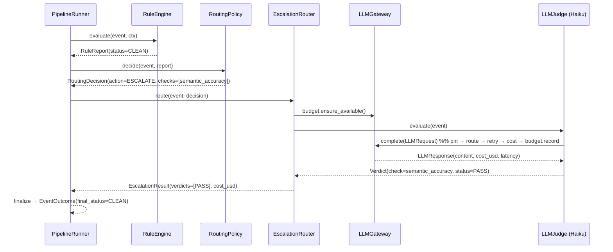
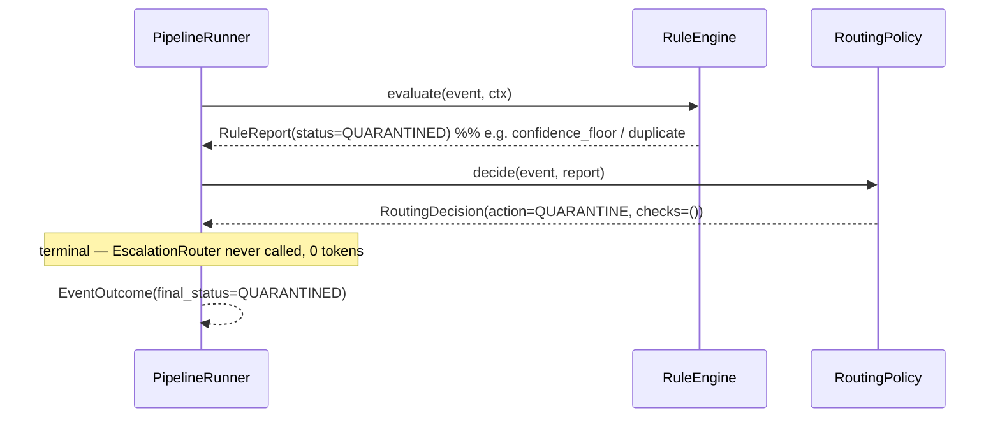
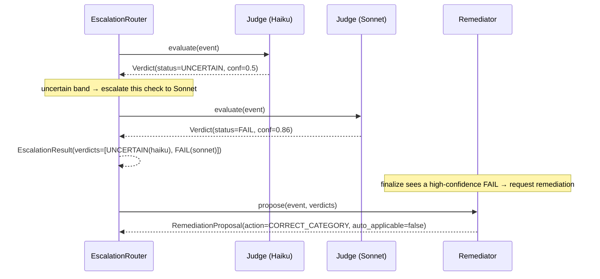
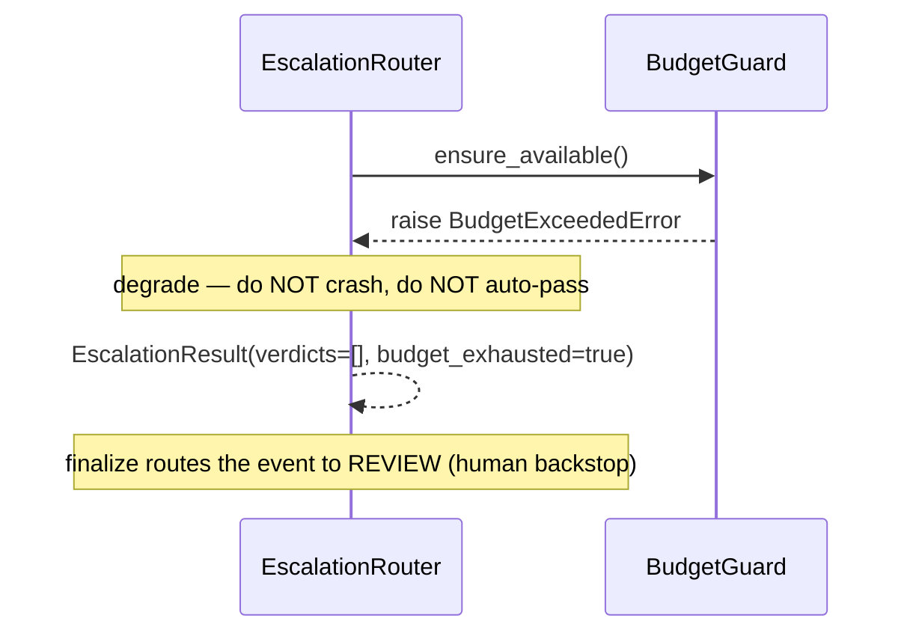
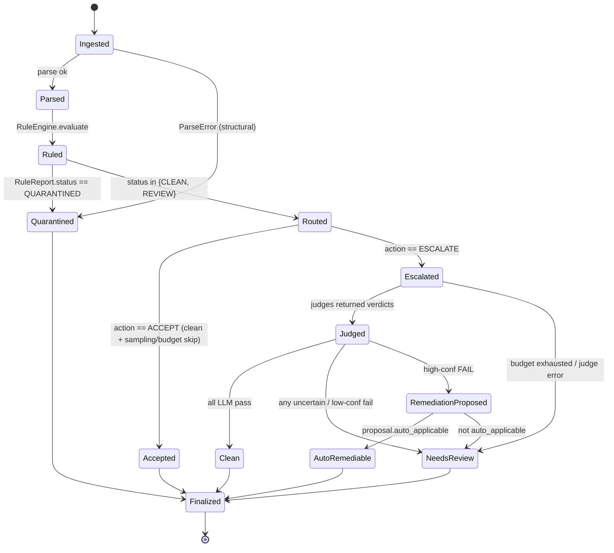

# VeritasAI — Phase 4 Pipeline Design Review

*Design only. No implementation, no commits. The Python blocks below are **contract
specifications** (interfaces + typed shapes, `...` bodies) for Phase 4, not code to be
run yet.*
*Date: 2026-06-23.*

This phase wires the components built in Phases 0–3 into one execution lifecycle. It adds
**no new judgement logic** — rules already judge structure, judges already judge meaning,
the gateway already meters cost. Phase 4 is the *orchestrator* and the *typed contracts*
that connect them, plus the seams for storage and monitoring (Phase 5+).

The guiding constraint from the README is unchanged: **rules gate, LLMs judge, humans
backstop, everything logged/versioned/measured — and never spend a token on a record a
rule already settled.**

---

## 1. End-to-end lifecycle

```
Dataset ─▶ Parser ─▶ RuleEngine ─▶ RoutingDecision ─▶ EscalationRouter ─▶ LLMJudge ─▶ RemediationProposal ─▶ Final Verdict
(.jsonl)   Resolved   RuleReport    (route action +     EscalationResult    Verdict      RemediationProposal    EventOutcome
           Event      / ParseError   checks to run)      (list[Verdict])                  (propose, never write)
```

Every arrow is a **typed handoff** — no stage passes a bare dict. The stage→type contract:

| Stage | Consumes | Produces |
|---|---|---|
| Parser ([ingest/parser.py](../src/veritas/ingest/parser.py)) | `str` (one JSON:API line) | `ResolvedEvent \| ParseError` |
| RuleEngine ([rules/engine.py](../src/veritas/rules/engine.py)) | `ResolvedEvent`, `RuleContext` | `RuleReport` |
| RoutingPolicy | `ResolvedEvent`, `RuleReport` | `RoutingDecision` |
| EscalationRouter | `ResolvedEvent`, `RoutingDecision` | `EscalationResult` (`list[Verdict]`) |
| LLMJudge ([judges/protocol.py](../src/veritas/judges/protocol.py)) | `ResolvedEvent` | `Verdict` |
| Remediator | `ResolvedEvent`, `Sequence[Verdict]` | `RemediationProposal` |
| PipelineRunner | `ResolvedEvent` (stream) | `EventOutcome` (stream) |

The **triage gate** lives between RuleEngine and EscalationRouter: a hard rule fail
(`RuleReport.status == QUARANTINED`) terminates the event with **zero LLM spend**. Only
rule-`CLEAN`/`REVIEW` events reach the judges.

---

## 2. Sequence diagrams

### 2a. Happy path — rule-clean, escalated for semantic judgement, passes



### 2b. Quarantine path — hard rule fail, no LLM spend



### 2c. Escalation band + remediation — Haiku uncertain → Sonnet → fail → propose fix



### 2d. Budget-exhausted degradation (fail-safe, never silently pass)



---

## 3. Event lifecycle state machine



**Terminal `final_status` values** (on `EventOutcome`): `CLEAN`, `QUARANTINED`, `REVIEW`,
`AUTO_REMEDIABLE`. The remediator **proposes**; even `AUTO_REMEDIABLE` is a *proposal to
apply*, never a silent write — application is a separate, audited step (out of Phase 4 scope).

---

## 4. Failure handling strategy

Per-stage policy, chosen so a failure never silently upgrades an event to `CLEAN`:

| Failure | Stage | Policy |
|---|---|---|
| Malformed line / no `data` / no `id` | Parser | `ParseError` → `EventOutcome(final_status=QUARANTINED, parse_error=…)`. Never crashes the run. |
| Rule raises (should be impossible — rules are pure) | RuleEngine | Treated as a defect; the runner wraps each event so one bad event can't kill the stream, routes it to `REVIEW`, emits a trace error. |
| `TransientLLMError` | Gateway | Retried inside the gateway (see §5); exhaustion bubbles up. |
| `PermanentLLMError` / `StructuredOutputError` | Gateway/Judge | No retry. The affected check yields **no pass** → event routes to `REVIEW` with the error in the trace. |
| `BudgetExceededError` | EscalationRouter | Degrade: stop issuing LLM calls, `budget_exhausted=True`, remaining events → `REVIEW`. |
| Poison event (repeatedly fails) | Runner | Bounded; emitted to a dead-letter outcome (`final_status=REVIEW`, `error` populated). No infinite loop. |

**Fail-safe default:** any uncertainty or failure the pipeline cannot resolve becomes
`REVIEW` (human backstop), never `CLEAN`. The only terminal-without-human paths are
rule-clean+LLM-pass (`CLEAN`) and hard fail (`QUARANTINED`).

---

## 5. Retry strategy

- **Transport-level retry already exists** in the gateway: `with_retry` + `RetryPolicy`
  ([llm_gateway/retry.py](../src/veritas/llm_gateway/retry.py)) retries only
  `TransientLLMError` with exponential backoff; `sleep` is injectable (tests = 0 delay).
- **No whole-event retry by default.** Because every verdict is idempotent (§6), re-running
  the *entire pipeline* over a shard is the retry mechanism — safe, resumable, no double-bill.
- **No retry on `PermanentLLMError`** — a 4xx or a schema-invalid response is a real signal,
  not a blip; it routes to `REVIEW`.
- Phase 4 adds **no new retry layer**; it only *configures* the existing `RetryPolicy` and
  decides escalation behavior on exhaustion (→ `REVIEW`).

---

## 6. Idempotency strategy

- **Canonical key:** `(event_id, check_name, prompt_version)` — already the shape of
  `Verdict`. A re-run produces the same key and **overwrites** (upsert), so a crash mid-shard
  and a re-run never double-count or double-bill.
- **Exact-duplicate rule** ([rules/checks.py](../src/veritas/rules/checks.py)) already handles
  the 7,875 cross-shard duplicate `event_id`s: first occurrence wins, repeats → `QUARANTINED`,
  so duplicates are never re-judged.
- **Determinism:** rules are pure; `now` is injected via `RuleContext`; judge `ts`/clock is
  injected. Given the same inputs + prompt versions, the pipeline yields the same
  `EventOutcome` — the precondition for the storage upsert and for ReplayJudge equivalence.
- **Resumability (Phase 5 storage):** the runner will skip events whose
  `(event_id, prompt_version-set)` already exist in the verdict store unless `--force`.

---

## 7. Cost accounting flow

```
LLMJudge.evaluate → LLMGateway.complete → PricingTable.cost(model, in_tok, out_tok)
        │                                          │
        │                                  BudgetGuard.record(cost)   (run-global meter)
        ▼                                          ▼
  Verdict.cost_usd / input_tokens / output_tokens / latency_ms     (per-check, per-event)
        ▼
  EscalationResult.cost_usd  = Σ verdict.cost_usd            (per-event)
        ▼
  EventOutcome.total_cost_usd                                 (per-event, persisted later)
        ▼
  run-level total = Σ EventOutcome.total_cost_usd  ==  BudgetGuard.spent   (reconciles)
```

Cost is computed **once**, at the gateway, from the confirmed pricing table
([llm_gateway/pricing.py](../src/veritas/llm_gateway/pricing.py)); every layer above only
*sums* it. Rule verdicts carry `cost_usd = None` (free). The run total must reconcile with
`BudgetGuard.spent` — a cheap invariant the runner asserts.

---

## 8. Budget guard integration

- A **single `BudgetGuard`** ([llm_gateway/budget.py](../src/veritas/llm_gateway/budget.py))
  is shared across the whole run (constructed from `settings.cost.monthly_budget_usd` or a
  per-run cap).
- The gateway already `ensure_available()`-before / `record()`-after each call. The
  **EscalationRouter additionally checks the guard before issuing a check**, so it can stop
  *early* and degrade gracefully rather than letting the gateway raise mid-judge.
- On exhaustion: `budget_exhausted=True`, remaining events → `REVIEW`. The run completes and
  reports how many events were budget-skipped (no silent truncation — logged per §11).
- The guard is the **throttle**, exactly as the README cost model intends.

---

## 9. Prompt version tracking

- Each LLM `Verdict` already carries `prompt_version` (set from `PromptSpec.version` by the
  judge) and `model`. The pipeline does not invent versioning — it **propagates** it.
- `EventOutcome.prompt_versions: dict[check_name, version]` records exactly which prompt
  produced each LLM verdict, so a stored outcome is self-describing.
- This is what makes the eval harness (Phase 3) and drift detection work: `GROUP BY
  prompt_version` over persisted verdicts, and the canary re-runs a frozen labeled set
  against the *pinned* `(model, prompt_version)`.

---

## 10. ReplayJudge compatibility

- The EscalationRouter depends only on the **`LLMJudge` Protocol**
  ([judges/protocol.py](../src/veritas/judges/protocol.py)) — `async evaluate(event) ->
  Verdict`. `ReplayJudge`, `AnthropicJudge`, `GeminiJudge` are all interchangeable.
- Injecting `ReplayJudge`s makes the **entire pipeline run offline, deterministic, and
  free** — the basis for pipeline tests and for replaying a recorded run end-to-end.
- The `EventOutcome` shape is **identical** whether judges are live or replayed; only
  `cost_usd` differs (replay = 0). So a pipeline integration test asserts on the same typed
  object an eval would.
- Escalation note: replayed verdicts already encode their tier (`model`), so the Haiku→Sonnet
  escalation in replay is satisfied by recording both verdicts for the escalated checks.

---

## 11. Future integration points (Phase 5+, contracts only here)

### 11a. Storage (not built yet)

```python
class VerdictSink(Protocol):
    async def upsert_verdicts(self, verdicts: Sequence[Verdict]) -> None: ...   # key: (event_id, check_name, prompt_version)

class OutcomeStore(Protocol):
    async def save_outcome(self, outcome: EventOutcome) -> None: ...
    async def seen(self, event_id: str, prompt_versions: Mapping[str, str]) -> bool: ...  # resumability
```

Maps onto the README DDL: `events_clean`, `quality_verdicts` (append-only, time-partitioned),
`quality_metrics_daily` (pre-aggregated). SQLAlchemy-on-SQLite now, Postgres-swappable. The
runner calls these sinks if provided; absent → in-memory only (today's behavior).

### 11b. Monitoring (not built yet)

Reuses the **interface-only** pattern already shipped for rules
([rules/metrics.py](../src/veritas/rules/metrics.py)):

```python
class PipelineTraceSink(Protocol):
    def on_outcome(self, outcome: EventOutcome) -> None: ...        # one trace row per event
    def on_judge_call(self, verdict: Verdict) -> None: ...          # token/cost/latency stream

class Tracer(Protocol):                                            # the deferred OTel seam
    def span(self, name: str, **attrs: str) -> AbstractContextManager[None]: ...
```

Surfaces: hard-rule-fail spike → alert; eval/canary regression (Phase 3 already exits
non-zero) → page; review-queue backlog → dashboard tile; budget burn from
`BudgetGuard.spent`. Default sinks are no-ops, so nothing is wired until a backend is
supplied — zero coupling, exactly like `NullMetricsSink`.

---

## 12. Exact contracts (Phase 4 deliverables)

Specifications, not implementations. All in a new `src/veritas/pipeline/` package; every
method consumes and returns the strongly-typed objects defined here or in earlier phases.

### 12a. Enums and value objects

```python
from enum import StrEnum

class RouteAction(StrEnum):
    QUARANTINE = "quarantine"   # terminal, no LLM spend
    ESCALATE   = "escalate"     # run the selected judges
    ACCEPT     = "accept"       # terminal clean, LLM skipped (sampling / budget)

class FinalStatus(StrEnum):
    CLEAN           = "clean"
    QUARANTINED     = "quarantined"
    REVIEW          = "review"
    AUTO_REMEDIABLE = "auto_remediable"

class RemediationAction(StrEnum):
    NONE             = "none"
    CORRECT_CATEGORY = "correct_category"
    CORRECT_FIELD    = "correct_field"
    SUGGEST_MERGE    = "suggest_merge"
    REJECT           = "reject"
```

### 12b. `RoutingDecision` — what the triage gate decided

```python
class RoutingDecision(BaseModel):
    model_config = ConfigDict(extra="forbid", frozen=True)

    event_id: str
    action: RouteAction
    checks: tuple[str, ...]      # judge check_names to run when action == ESCALATE
    reason: str                  # human-readable justification (audit trail)
    sampled: bool = False        # was this selected by a sampling policy?

class RoutingPolicy(Protocol):
    """Pure: derives a routing decision from the rule report. No I/O."""
    def decide(self, event: ResolvedEvent, report: RuleReport) -> RoutingDecision: ...
```

### 12c. `EscalationRouter` — executes the LLM escalation band

```python
class EscalationResult(BaseModel):
    model_config = ConfigDict(extra="forbid")

    event_id: str
    verdicts: list[Verdict]              # LLM verdicts (check_type == LLM)
    escalated_checks: tuple[str, ...]    # checks that escalated cheap-tier → expensive-tier
    cost_usd: float
    budget_exhausted: bool = False

class EscalationRouter(Protocol):
    """Runs the decision's checks via injected LLMJudges, applying the
    Haiku→Sonnet uncertain-band escalation and the BudgetGuard. ReplayJudge-compatible."""
    async def route(self, event: ResolvedEvent, decision: RoutingDecision) -> EscalationResult: ...
```

### 12d. `RemediationProposal` — proposes, never writes

```python
class RemediationProposal(BaseModel):
    model_config = ConfigDict(extra="forbid")

    event_id: str
    action: RemediationAction
    target_field: str | None = None     # e.g. "category"
    proposed_value: str | None = None   # e.g. the corrected category
    merge_target_id: str | None = None  # for SUGGEST_MERGE
    reason: str
    confidence: float | None = None
    proposer: str                       # skill id / model id that produced it
    prompt_version: str | None = None
    auto_applicable: bool = False       # high-conf + low-risk → eligible for auto-apply

class Remediator(Protocol):
    async def propose(self, event: ResolvedEvent, verdicts: Sequence[Verdict]) -> RemediationProposal: ...
```

### 12e. `EventOutcome` — the Final Verdict (the pipeline's output unit)

```python
class EventOutcome(BaseModel):
    model_config = ConfigDict(extra="forbid")

    event_id: str
    final_status: FinalStatus
    rule_report: RuleReport
    llm_verdicts: list[Verdict]
    routing: RoutingDecision
    remediation: RemediationProposal | None = None
    total_cost_usd: float = 0.0
    prompt_versions: dict[str, str] = {}    # check_name -> prompt_version used
    parse_error: ParseError | None = None   # set when the line failed to parse
    error: str | None = None                # set when a stage failed (→ REVIEW)
```

### 12f. `PipelineRunner` — the orchestrator

```python
class PipelineRunner:
    """Composes the lifecycle. All collaborators are injected (DI) so the same
    runner serves live judges, ReplayJudges (offline/eval), and tests."""

    def __init__(
        self,
        *,
        rule_engine: RuleEngine,
        rule_context: RuleContext,
        routing_policy: RoutingPolicy,
        escalation_router: EscalationRouter,
        remediator: Remediator,
        budget: BudgetGuard,
        verdict_sink: VerdictSink | None = None,      # Phase 5 — default no-op/in-memory
        trace_sink: PipelineTraceSink | None = None,  # Phase 5 — default no-op
    ) -> None: ...

    async def run_event(self, event: ResolvedEvent) -> EventOutcome: ...

    async def run(
        self, events: AsyncIterable[ResolvedEvent] | Iterable[ResolvedEvent]
    ) -> AsyncIterator[EventOutcome]: ...
```

**`finalize` rule** (how `run_event` derives `final_status`, no new judgement):
1. `parse_error` present → `QUARANTINED`.
2. `RuleReport.status == QUARANTINED` → `QUARANTINED` (no LLM ran).
3. else escalate; over the LLM verdicts:
   - any `FAIL` with `confidence ≥ thresholds.llm_fail_min_confidence` → request remediation;
     `AUTO_REMEDIABLE` if `proposal.auto_applicable` else `REVIEW`;
   - else any `UNCERTAIN` / low-confidence `FAIL` / `budget_exhausted` / stage `error` → `REVIEW`;
   - else all `PASS` → `CLEAN`.

This reuses `thresholds.llm_fail_min_confidence` from [config.py](../src/veritas/config.py)
and mirrors the README §5 verdict precedence exactly.

---

## 13. What Phase 4 will and will not build

**Will:** the `src/veritas/pipeline/` package implementing the contracts above (RoutingPolicy,
EscalationRouter, Remediator, PipelineRunner, EventOutcome), a default `RoutingPolicy` driven
by `RuleReport.status`, the Haiku→Sonnet escalation, the `finalize` rollup, the
remediation **skill** spec, and pipeline tests using `ReplayJudge` (offline, deterministic).

**Will not (deferred):** the storage layer (`VerdictSink`/`OutcomeStore` implementations),
monitoring/canary scheduling, the dashboard. Their **seams are defined here** (§11) so the
runner takes them as optional injected sinks with no-op defaults — zero rework when they land.

---

## 14. Open questions for the reviewer

1. **Do rule-`CLEAN` events still get the semantic-accuracy judge?** Proposed: **yes** — rules
   can't judge meaning, so `CLEAN` still escalates to the Haiku semantic check; only
   `QUARANTINED` skips LLM. (Alternative: sample clean records to cut cost — modeled via
   `RouteAction.ACCEPT` + `sampled`.)
2. **Auto-apply remediations?** Proposed: **never silently** in Phase 4 — `AUTO_REMEDIABLE` is
   a flagged proposal; actual application is a separate audited step.
3. **Escalation granularity:** escalate the *uncertain check* to Sonnet (proposed), vs escalate
   the *whole event*. Per-check is cheaper and more precise.
4. **Concurrency model:** bounded-concurrency async fan-out over the event stream (proposed),
   with the `BudgetGuard` as the shared throttle — confirm the cap belongs in `PipelineRunner`
   vs a separate scheduler.
