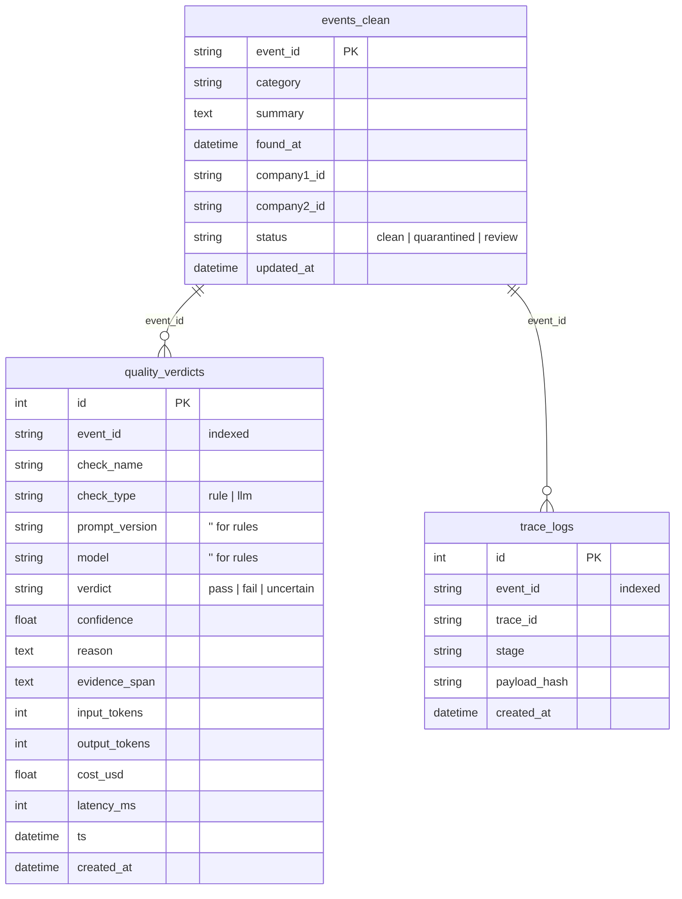

# VeritasAI — Storage Layer Design (Phase 5)

*SQLAlchemy 2.0, async, SQLite by default, PostgreSQL-ready. Storage-independent
pipeline: repositories speak domain types; sinks bridge pipeline outcomes to them.*
*Date: 2026-06-23.*

## 1. Goals → mechanisms

| Goal | Mechanism |
|---|---|
| **Strong typing** | SQLAlchemy 2.0 `Mapped[...]` ORM models; repositories take/return `Verdict` and primitives, MyPy-strict clean |
| **Idempotent writes** | unique key `(event_id, check_name, prompt_version, model)`; portable select-then-insert/update upsert |
| **Replay-safe** | re-running the pipeline overwrites verdicts/events by key — no duplicates, no double-count |
| **Storage-independent pipeline** | the pipeline depends only on the `VerdictSink`/`PipelineTraceSink` Protocols; repositories never import pipeline types |

## 2. Schema

`UNIQUE (event_id, check_name, prompt_version, model)` on `quality_verdicts` is the
idempotency key.

### The NULL-key subtlety (important)

SQL treats `NULL`s as **distinct** in a unique constraint, so two rule verdicts with
`prompt_version = NULL, model = NULL` would *not* collide — defeating idempotency for the
free, high-volume rule checks. We therefore store **`""` (empty string), never NULL**, for
those two columns on rule verdicts (`Verdict.prompt_version is None → ""`), and map `""`
back to `None` on read. The constraint then dedupes rules and LLM verdicts uniformly.

## 3. Idempotent upsert

Portable across SQLite and Postgres: per verdict, `SELECT` by the four-column key; if present,
update the mutable fields in place (keeping the original `created_at` — first-write-wins); else
insert. Wrapped in one transaction per batch. `events_clean` upserts by its `event_id` primary
key the same way. `trace_logs` is **append-only** (an audit trail) — a replay appends a new row
with the same deterministic `trace_id = uuid5(ns, event_id)` and a content `payload_hash`, so
duplicate emissions are detectable but not silently merged.

> A production Postgres deployment can swap the two-statement upsert for a single
> `INSERT ... ON CONFLICT DO UPDATE`; the portable form is used now to keep one code path
> across both engines.

## 4. Pipeline integration

`PipelineRunner` optionally accepts a `VerdictSink` and a `PipelineTraceSink`:

- `RepositoryVerdictSink` → `VerdictRepository.upsert_verdicts` → `quality_verdicts`.
- `RepositoryTraceSink` → `EventRepository.upsert` (`events_clean`, from the outcome's
  `EventSnapshot` + `final_status`) **and** `TraceRepository.append` (`trace_logs`).

Sinks default to `None`, so the pipeline runs fully in-memory with no storage — the storage
layer is strictly opt-in and the pipeline has zero compile-time dependency on it. (`on_outcome`
was made async in Phase 5 so a DB-backed sink can write without event-loop hacks.)

## 5. Engine, sessions, SQLite → Postgres

`Database` owns an async engine + `async_sessionmaker`. Default URL
`sqlite+aiosqlite:///./veritas.db`; tests use `Database.in_memory()` (shared-connection
`StaticPool`). Moving to async Postgres is a **URL change only**
(`postgresql+asyncpg://…`) plus adding the `asyncpg` driver — no ORM or repository code
changes, because the models avoid SQLite-only types and name every constraint via a metadata
naming convention.

## 6. Partitioning strategy (Postgres, future)

- `quality_verdicts` is append-heavy and time-ordered → **range-partition by `created_at`**
  (monthly), with the unique key local to each partition. Old partitions detach/archive cheaply.
- `trace_logs` likewise **range-partitioned by `created_at`**; it is pure audit and can have a
  shorter retention than verdicts.
- `events_clean` is the current-state table (one row per event), so it is **not partitioned**;
  it is kept small and indexed by `status` for the review-queue and dashboard queries.
- Pre-aggregation: a `quality_metrics_daily` rollup (README §9) is computed from
  `quality_verdicts` so dashboards never scan raw rows. (Not built in Phase 5.)

SQLite ignores partitioning; the schema is identical, so dev and prod stay in lockstep.

## 7. PostgreSQL migration plan (Alembic)

Scaffolding is shipped (`alembic.ini`, `alembic/env.py`, `alembic/script.py.mako`,
`alembic/versions/`) but **no migration workflow is built yet** (per scope). `env.py` resolves
the URL from settings (reducing the async driver to its sync form for Alembic) and uses
`Base.metadata` as the single source of truth, with `compare_type=True`.

Path to production:
1. SQLite/dev uses `Database.create_all()` (no migrations needed).
2. For Postgres, generate the initial revision with `alembic revision --autogenerate`, review it
   (the naming convention keeps constraint names stable and diff-clean), then `alembic upgrade head`.
3. CI runs `alembic upgrade head` against a disposable Postgres; `create_all` is never used in prod.

## 8. Tests (`tests/test_store.py`)

Repository round-trips; idempotent upsert (same key updates in place, no new row); the
NULL-key idempotency for rule verdicts; distinct-model rows are distinct; event status update;
append-only traces; repository sinks persist an `EventOutcome`; and a full **pipeline →
storage** integration that runs twice and asserts verdicts/events counts are **stable across the
replay** (idempotent) while `trace_logs` appends — proving replay-safety end to end.
